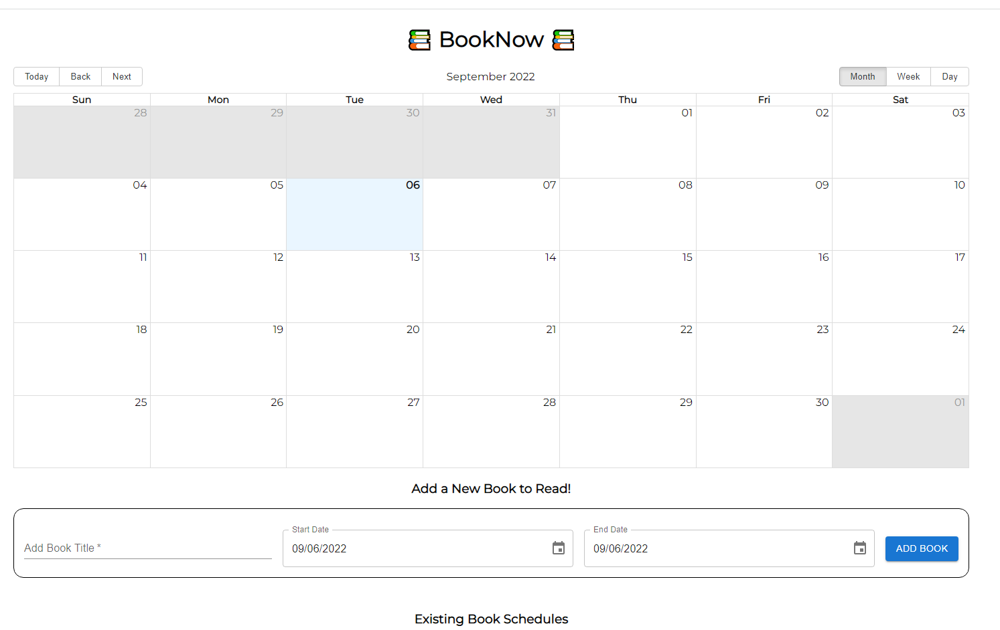

# Book-club REST API calendar

This REST API endpoints project connect the React front-end to a Node.js back-end.
This project was built to practice working with **React**, **React router**, **Node**, **Express** and **API**.

## Usage

This project was bootstrapped with [Create React App](https://github.com/facebook/create-react-app).\
This project was deployed using Netlify [here](https://bookclub-calendar.netlify.app/).

In the project directory, you can run:

### `npm run start`

Runs the app in the development mode.\
Open [http://localhost:3000](http://localhost:3000) to view it in your browser.

The page will reload when you make changes.\
You may also see any lint errors in the console.

### `npm test`

Launches the test runner in the interactive watch mode.

## Features

At the starting page, users will be able to add books to read to the calendar, see existing book schedules, 
deleting and updating books to the calendar.

## Future Development 

The project may be updated to store the data in a database such as Postgres.

## Sources

This project was created as part of [Codecademy's Fullstack Engineer](https://www.codecademy.com/learn) curriculum. 